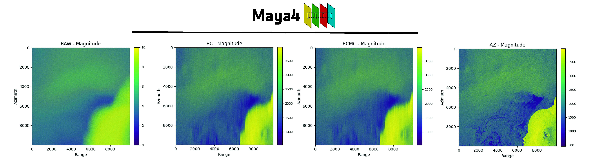

<div align="center">


### Multi-Level SAR Processing & PyTorch DataLoader

*Unveiling the layers of Synthetic Aperture Radar data from Sentinel-1 missions*

[](https://www.python.org/downloads/)
[](https://pytorch.org/)
[](https://www.gnu.org/licenses/gpl-3.0)
[](https://github.com/psf/black)
[](https://huggingface.co/Maya4)

[Overview](#-overview) •
[Installation](#-installation) •
[Quick Start](#-quick-start) •
[Processing Levels](#-processing-levels) •
[Citation](#-citation)

</div>

---

## 🎯 Overview

Maya4 is a production-ready Python package and dataset organization dedicated to curating and providing **multi-level intermediate SAR representations** from Sentinel-1 acquisitions, spanning the entire processing chain from Level 0 (raw) to Level 1 (focused imagery).

### The Māyā Philosophy

The name **Maya4** draws inspiration from the *Māyā veil* in philosophy, where reality is hidden behind successive layers—just as radar echoes undergo multiple transformations before forming a final SAR image. Each processing level reveals a different aspect of the electromagnetic interaction with Earth's surface.

### Why Maya4?

- **🎚️ Multi-Level Access**: Complete processing chain from raw echoes to focused imagery
- **🚀 Performance**: Zarr-based storage with intelligent chunk caching and lazy loading
- **🔧 Flexibility**: Access any intermediate representation for research and experimentation
- **☁️ Cloud-Native**: Native Hugging Face Hub integration with 68TB+ of curated data
- **📊 ML-Ready**: PyTorch-compatible dataloaders optimized for pre-training workflows
- **🌍 Geographic-Aware**: Built-in support for location-based clustering and filtering

---

## 🌐 Processing Levels




Maya4 exposes the complete SAR processing chain through intermediate signal representations:

| Level | Abbrev. | Description | Purpose / Value |
|-------|---------|-------------|-----------------|
| 📡 **Raw** | `raw` | Unprocessed radar echoes as recorded by Sentinel-1 | Baseline data; enables full custom SAR processing |
| 🎚️ **Range Compressed** | `rc` | Echoes compressed in range via matched filtering | Improved SNR; isolates scatterers along range |
| 🎯 **Range Cell Migration Corrected** | `rcmc` | Motion-compensated with corrected range migration | Preserves geometric fidelity; enables azimuth focusing |
| 🖼️ **Azimuth Compressed** | `ac` | Fully focused SAR image in slant-range geometry | Standard Level-1 product; interpretable imagery |

Each level represents a distinct transformation in the SAR focusing pipeline, allowing researchers to:
- **Experiment** with custom processing algorithms
- **Pre-train** deep learning models on intermediate representations
- **Analyze** signal characteristics at different processing stages
- **Develop** novel focusing techniques

---

## 📦 Pre-Training Datasets

Maya4 provides curated Pre-Training (PT) datasets in cloud-native Zarr format:

| Dataset Split | Contents | Acquisition Mode | Size | Hub Link |
|---------------|----------|------------------|------|----------|
| **PT1** | Multi-level SAR data | Stripmap | 17 TB | [🤗 Maya4/PT1](https://huggingface.co/datasets/Maya4/PT1) |
| **PT2** | Multi-level SAR data | Stripmap | 17 TB | [🤗 Maya4/PT2](https://huggingface.co/datasets/Maya4/PT2) |
| **PT3** | Multi-level SAR data | Stripmap | 17 TB | Coming Soon |
| **PT4** | Multi-level SAR data | Stripmap | 17 TB | [🤗 Maya4/PT4](https://huggingface.co/datasets/Maya4/PT4) |
| **Total** | — | — | **68 TB** | — |

*Data provided by the Copernicus Sentinel-1 mission (ESA)*

---

## ✨ Features

<table>
<tr>
<td width="50%">

### Core Capabilities
- **Multi-Level Data Access**  
  Complete processing chain from raw to focused
  
- **Zarr Backend**  
  Scalable, chunked storage for 68TB+ datasets
  
- **Normalization Suite**  
  MinMax, Z-Score, Robust, and Adaptive strategies
  
- **HuggingFace Integration**  
  Direct loading from Maya4 Hub repositories

</td>
<td width="50%">

### Advanced Features
- **Geographic Clustering**  
  Balanced sampling by location distribution
  
- **Positional Encoding**  
  Built-in transformer-compatible embeddings
  
- **Flexible Patch Modes**  
  Rectangular and parabolic extraction
  
- **Lazy Loading**  
  Memory-efficient processing of massive datasets

</td>
</tr>
</table>

---

## 📦 Installation

### Quick Install

```bash
# Using PDM (recommended)
pdm install

# Using pip
pip install -e .
```

### Environment-Specific Installation

<details>
<summary><b>Jupyter Environment</b></summary>

```bash
pdm install -G jupyter_env
```

Includes Jupyter notebook and lab dependencies for interactive development.
</details>

<details>
<summary><b>Geospatial Features</b></summary>

```bash
pdm install -G geospatial
```

Adds geographic processing tools and coordinate system support.
</details>

<details>
<summary><b>Development Setup</b></summary>

```bash
pdm install -G dev
```

Installs testing, linting, and development utilities.
</details>

<details>
<summary><b>Complete Installation</b></summary>

```bash
pdm install -G :all
```

Installs all optional dependencies for full functionality.
</details>

### Requirements

- Python 3.8+
- PyTorch 2.0+
- CUDA (optional, for GPU acceleration)

---

## 📖 Citation

If you use Maya4 datasets or tools in your research, please cite:

```bibtex
@software{maya4_2024,
  author       = {Del Prete, Roberto and Maya4 Organization},
  title        = {Maya4: Multi-Level SAR Processing and Intermediate Representations},
  year         = {2024},
  publisher    = {Hugging Face},
  howpublished = {\url{https://huggingface.co/Maya4}},
  note         = {68TB+ curated Sentinel-1 Stripmap data spanning processing levels from raw to focused imagery}
}
```


---

<div align="center">

Made with ❤️ by the Maya4 Team

</div>
